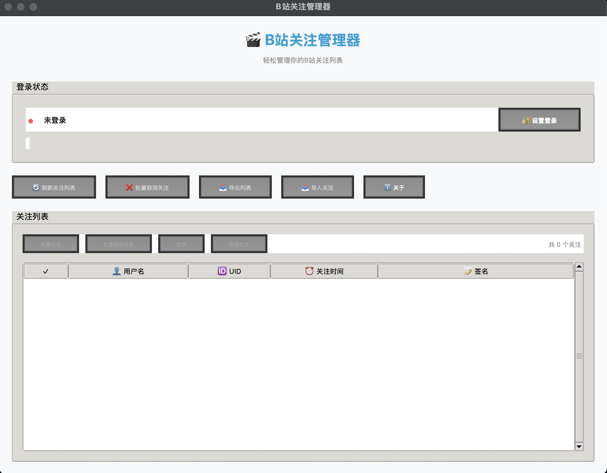

# B站关注管理器 v1.1

🎬 现代化的B站关注管理工具，提供美观的图形界面和自动登录功能。

> **作者**: 一懒众衫小 (Noeky)
> **B站**: [一懒众衫小](https://space.bilibili.com/1503656076/)

## 🚀 v1.1 版本更新日志

- **⚡ 更轻更快**: 彻底移除了 Selenium/Chrome 依赖
- **📱 原生扫码**: 接入 B 站官方扫码接口，内置二维码生成，登录体验更丝滑

## ✨ 功能特色

- 🔐 **自动登录**: 第一次登录使用B站App扫码，凭据安全保存在本地，无需重复扫码
- 📊 **智能展示**: 完整显示关注用户信息（用户名、UID、关注时间、签名）
- ⚡ **批量操作**: 支持批量取消关注和批量关注，提高管理效率
- 💾 **数据导出**: 一键导出关注列表为JSON文件
- 📤 **导入关注**: 从导出文件一键批量关注所有用户

## 安装

如果使用MacOS或Linux系统

```bash
pip install -r requirements.txt
```

启动GUI

```bash
python app.py
```

如果使用Windows系统，直接运行批处理文件`launch.bat`

## 🎯 操作说明



1. **设置登录**: 点击"🔐 设置登录"按钮，扫码完成登陆
2. **刷新列表**: 点击"🔄 刷新关注列表"获取最新数据（关注过多可能会有卡顿，这是正常现象）
3. **选择用户**: 在列表中选择要取消关注的用户（支持多选）
4. **批量取消关注**: 点击"❌ 批量取消关注"执行批量取消关注操作
5. **导出数据**: 点击"📥 导出列表"保存数据到本地
6. **导入关注**: 点击"📤 导入关注"选择JSON文件批量关注用户

**使用场景**:

- 🔄 换账户同步关注列表
- 👥 导入朋友推荐的UP主列表
- 🔒 账号恢复后快速恢复关注

## ⭐ 支持项目

如果这个项目对您有帮助，请给个 Star ⭐ 支持一下！
